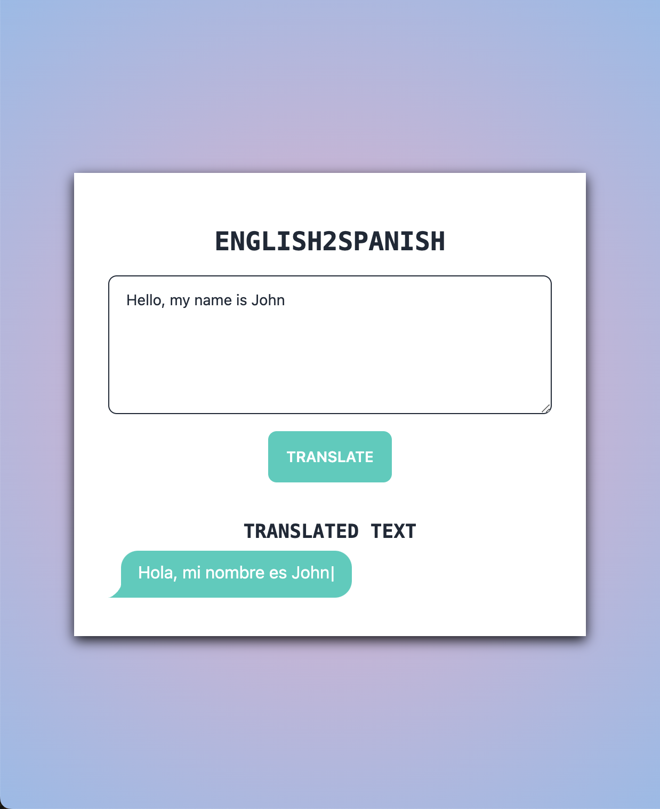

# Englinsh2Spanish

English to spanish language translation via [Google Translate API](https://console.cloud.google.com/apis/library/translate.googleapis.com?project=english2spanish) 


## Screenshots




## Installation

Install with npm in root


```bash
  npm install
  npm run dev
```
    
## Environment Variables

To run this project, you will need to create a .env file in root and add the following environment variables
`'VITE_REACT_APP_GOOGLE_TRANSLATE_API_KEY=YOUR_API_KEY'`

You can create a Translation API key [google cloud console](https://console.cloud.google.com/)

## Authors

- [@rhyspjudd-dev](https://github.com/rhyspjudd-dev)

